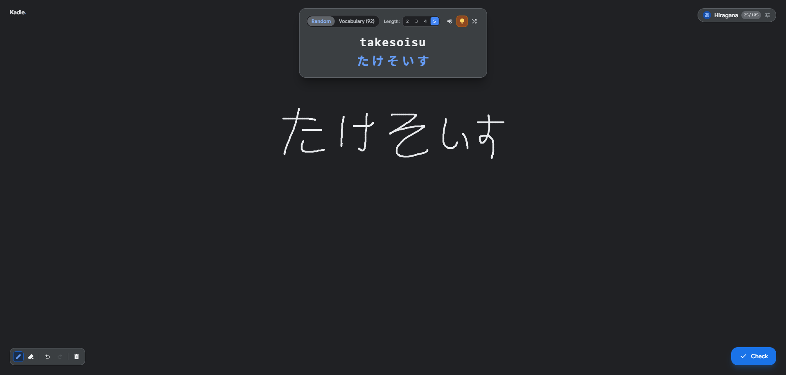
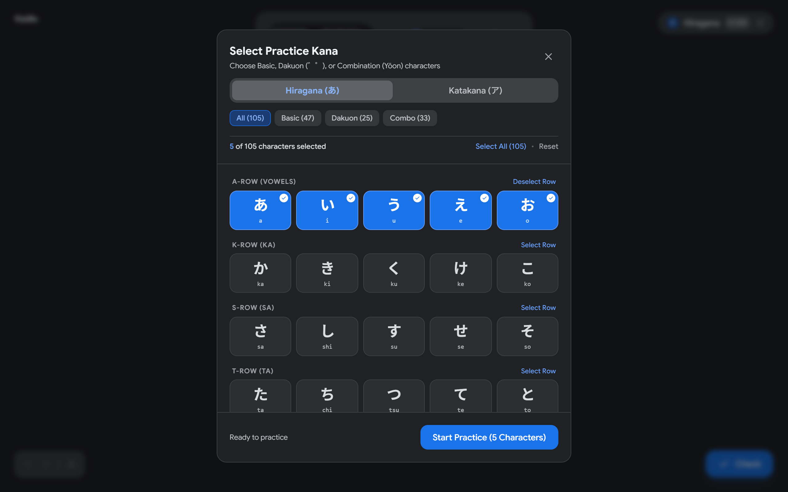
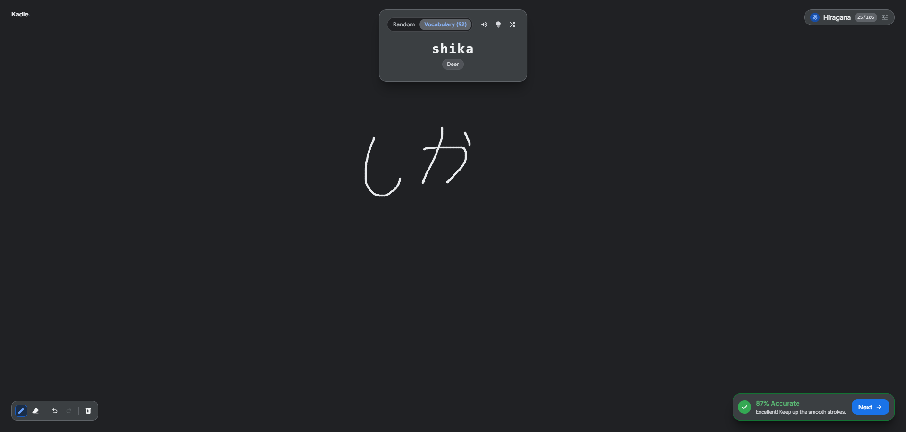

# Kadle: Kana Doodle

> **Kadle** (Kana + Doodle) is an interactive, privacy-first Japanese handwriting practice web application powered by client-side AI handwriting recognition.

<p align="center">
  
</p>

---

## Features

- **Zero-Latency Drawing Canvas**
  - Smooth vector stroke capture with native touch, pen, and mouse support.
  - Floating minimal controls: **Pen** (`P`), **Stroke Eraser** (`E`), **Undo** (`Ctrl+Z`), **Redo** (`Ctrl+Y`), and **Clear All**.
  - High-DPI screen auto-scaling with sub-pixel rendering.

- **On-Device AI Handwriting Recognition (`onnxruntime-web`)**
  - Powered by a ResNet FP16 model trained on JIS X 0208 (3,082 classes including Hiragana, Katakana, and Kanji).
  - **100% Client-Side**: Inference runs directly in your browser via WebAssembly (WASM)—no backend server, zero API costs, and complete privacy.
  - **Hierarchical Stroke Clustering**: Automatically segments and normalizes multi-character handwriting from left to right.
  - **Single-Point Dot Support**: Accurately recognizes punctuation dots and dakuten (`゛`, `゜`) strokes.

- **Live Download Tracking & CacheStorage Persistence**
  - Live download progress tracking via Web Streams API (`ReadableStream`).
  - Action button displays real-time download status (e.g. `Downloading AI (45% · 6.5/14.5 MB)`).
  - Automatically caches the 14.5 MB model into `window.caches` (CacheStorage), allowing sub-100ms instant loads on subsequent visits and offline use.

- **Dynamic Kana Deck Selector**
  - Customize your active practice set: toggle individual characters or full rows (*A, Ka, Sa, Ta, Na, Ha, Ma, Ya, Ra, Wa*).
  - Support for **Basic (Gojūon)**, **Dakuon/Handakuon**, and **Combination (Yōon)** characters across both **Hiragana** and **Katakana**.
  - **Strict Vocabulary Filtering**: In vocabulary mode, Kadle only generates words that can be formed using your currently selected deck.

<p align="center">
  
</p>

- **Smart Quiz Game Loop**
  - **Random Mode**: Practice arbitrary Kana strings with configurable word lengths (2 to 5 characters).
  - **Vocabulary Mode**: Practice real Japanese words (with English meanings).
  - **Kana Hint Toggle**: Peek at the actual Kana characters when you need help.

- **Informative Feedback Without Spoiling**
  - AI pinpoints which character was mismatched (e.g., `AI recognized character #1 as 'か'.`) without leaking the target answer.
  - User-driven retry loop: focuses on repetition until mastery.

<p align="center">
  
</p>

---

## Tech Stack

- **Frontend**: [React 19](https://react.dev/) + [TypeScript](https://www.typescriptlang.org/)
- **Build Tool**: [Vite](https://vite.dev/)
- **Styling**: [Tailwind CSS v4](https://tailwindcss.com/) + [Tailwind Animate](https://github.com/jamiebuilds/tailwindcss-animate)
- **UI Primitives**: [@base-ui/react](https://base-ui.com/) (accessible headless Dialog, Toolbar, Tabs, Tooltip)
- **AI Runtime**: [ONNX Runtime Web](https://onnxruntime.ai/) (`onnxruntime-web@1.20.1` WASM)
- **Icons & Typography**: Material Symbols Outlined + Google Sans / Noto Sans JP
- **Linter**: [Oxlint](https://oxc.rs/)
- **Package Manager**: [Bun](https://bun.sh/)

---

## Getting Started

### Prerequisites
Make sure you have [Bun](https://bun.sh/) installed:
```bash
# macOS / Linux / WSL
curl -fsSL https://bun.sh/install | bash

# Windows PowerShell
powershell -c "irm bun.sh/install.ps1 | iex"
```

### Installation
```bash
# Clone the repository
git clone https://github.com/your-username/kadle.git
cd kadle

# Install dependencies
bun install
```

### Running Locally
```bash
bun run dev
```
Open `http://localhost:5173` in your browser.

### Building for Production
```bash
bun run build
```
Static production files will be output to the `dist/` directory.

> [!TIP]
> The ONNX model and JIS label files in `public/` are served with global CDN caching. Kadle's CacheStorage implementation ensures user browsers store the model locally on first load.

---

## Roadmap

Features planned or currently in development:

- **Audio Pronunciation**: Reliable native Japanese audio playback using bundled audio assets or dedicated TTS (replacing browser SpeechSynthesis which often fails without installed OS voice packs).
- **Stroke Order Guidance**: Stroke animation and step-by-step stroke count validation.
- **Spaced Repetition System (SRS)**: Accuracy tracking and scheduled reviews for difficult characters.
- **Kanji Support**: Expanding quiz decks to common JLPT (N5–N1) Kanji characters using the model's existing JIS X 0208 recognition capabilities.

---

## License

Distributed under the MIT License. Feel free to use and adapt this project for your own Japanese learning tools.
